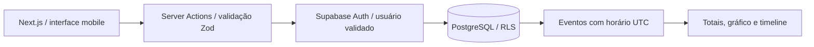

# Arquitetura e decisões — etapa 1

## Fluxo principal

Next.js App Router e TypeScript; Tailwind para base de estilos e componentes Button/Dialog no padrão shadcn com Radix, estilizados para o produto. React Hook Form + Zod nos formulários de água e alimentos; formulários dinâmicos de check-in, refeições e metas com estado controlado e validação Zod no servidor. Recharts no gráfico. Supabase SSR gerencia cookies e renovação de sessão. Nenhuma chave administrativa é utilizada.

## Schema executável

| Tabela | Responsabilidade |
|---|---|
| `auth.users` | Identidade gerenciada pelo Supabase Auth |
| `profiles` | Nome, timezone e configuração inicial de atalhos |
| `target_templates` | Modelos privados para cada tipo de dia |
| `days` | Data e metas efetivas; snapshot antes de registrar o primeiro evento |
| `events` | Envelope temporal e payload validado: água, check-in ou refeição |
| `event_revisions` | Cópia anterior de cada registro editado ou excluído |
| `foods` | Valores nutricionais por 100 g, marca e favorito |
| `meal_templates` | Combinações reutilizáveis com quantidades e snapshots |
| `checkin_drafts` | Um rascunho privado por usuário, excluído na inserção de um check-in |

Migrations versionadas são a especificação executável. UUIDs nas chaves; todas as tabelas privadas têm `user_id` (ou perfil com `id=auth.uid()`) e RLS. O cliente não escolhe o proprietário: as ações o obtêm da sessão validada. Políticas de banco continuam válidas mesmo se o cliente ignorar a interface. Auditoria permite leitura do dono e proíbe modificações pelos usuários.

## Eventos e extensibilidade

O envelope guarda `id`, `user_id`, `timestamp`, `local_date`, `timezone`, `type`, `source`, `measurement_type`, `estimated`, `confidence`, `import_source`, `source_record_id`, `notes`, `data`, `created_at`, `updated_at`. `timestamp` é `timestamptz`; um trigger deriva a data local em Europe/London. Horários inexistentes ou ambíguos nas mudanças de horário de verão são recusados pela interface, sem conversão silenciosa.

Nesta etapa, payloads tipados em JSONB preservam check-ins esparsos, tags e snapshots nutricionais sem dezenas de tabelas vazias. Constraints e triggers validam o envelope, volumes e escalas; Zod valida detalhadamente cada gravação pelo aplicativo. Índice composto `(user_id, local_date, timestamp)` atende a timeline. Índice GIN permite consultas futuras aos payloads. Não há análise de correlação executada nesta versão.

Zero e null são mantidos separados; campos não preenchidos permanecem desconhecidos. Agregações não transformam ausência em medição zero. Nutrientes parciais são somados somente quando informados, com aviso na interface; o relatório futuro deve expor completude por nutriente. Água pura é separada de outros líquidos.

## Metas

Os sete valores nutricionais/de água informados no briefing são **seeds do banco por usuário**, nunca constantes utilizadas como fallback da aplicação autenticada. As constantes em `lib/demo.ts` são exclusivamente dados fictícios da demonstração. Sono, passos e exercício não recebem alvos inventados. A interface permite configurá-los, mas dados desses módulos ainda não são registrados.

A meta é `{kind,min,max}`, nas unidades canônicas. Máximo apresenta saldo até o limite, intervalo apresenta faixa e estado, mínimo/alvo apresentam falta e progresso. Modelos são específicos por usuário; escolher o modelo altera o formulário, e salvar grava o dia. A opção de reutilizar atualiza também o modelo. A primeira gravação do dia preserva as metas então vigentes.

## Alimentação

Alimentos armazenam nutrientes por 100 g. Itens de refeições copiam nome e nutrientes com a quantidade registrada. Alterar uma biblioteca futura não recalculará retroativamente o histórico. Uma refeição pode conter somente horário, com outros campos vazios. Combinações podem ser salvas e reutilizadas.

Receitas com rendimento cozido pedem entidades `recipes` e `recipe_ingredients`, soma nutricional dos ingredientes e normalização pelo peso final. Isso está proposto para a próxima expansão da alimentação; não é confundido com refeições salvas.

## Schema proposto para as próximas etapas (não migrado)

- `recipes`, `recipe_ingredients`: ingredientes, alimento de origem, pesos e rendimento.
- `sleep_logs`: duração e estágios objetivos, dispositivo e fonte; avaliações subjetivas continuam em eventos separados.
- `workouts`, `tennis_sessions`, `tennis_sets`: evento, duração, FC, zonas, placares; calorias ativas e totais em colunas distintas.
- `health_daily_metrics`: usuário, data, metric, device, unit, value, source e identificador externo; índices e unicidade por origem/registro.
- `health_imports`: hash de arquivo, formato, status, contagens, origem e erros. Importação em lotes, revisável e idempotente.
- `stool_logs`, `symptom_logs`, `caffeine_logs`: extensão tipada dos eventos. Fezes usam escala pessoal 0–10, sem conversão automática para Bristol.
- `supplements`, `supplement_logs`, `medications`, `medication_logs`: bibliotecas e eventos separados.
- `photos`: somente referência a objetos em bucket privado, URLs assinadas e políticas por usuário; não guardar imagem binária no event log.
- `daily_summaries`: snapshot versionado, fechamento e reabertura; dados originais continuam sendo a fonte.

Chaves dessas extensões referenciam eventos e usuário com validação de propriedade. O índice único já existente em eventos `(user_id,import_source,source_record_id)` prepara a deduplicação, mas não constitui um importador.

## Segurança e operação

Rotas privadas e operações verificam usuário no servidor; RLS dá a segunda camada. Cache de páginas pessoais desativado, `noindex`, `noarchive`, bloqueio de iframe, `nosniff` e mesma origem para referer. Nunca enviar dados clínicos para logs de aplicação. HTTPS vem da hospedagem. Políticas e restauração de backup precisam ser configuradas no projeto Supabase escolhido antes do uso real.

Não existe service worker que armazene respostas privadas. PWA é somente preparação de instalação nesta fase. Não existe modo offline que simule gravação bem-sucedida: erros de rede são apresentados ao usuário.

## Validação e pendências

Testes de domínio cobrem horários de verão, conversão de porções, água pura, metas e null/zero. Banco é testado com duas identidades fictícias e role anônima. Preview usa somente fixtures. O teste fim a fim de login, gravação, persistência após recarregar e rascunhos entre dispositivos depende do projeto Supabase real. Publicação Vercel, importação do histórico e novos módulos estão fora desta entrega inicial.
